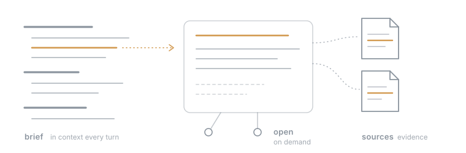
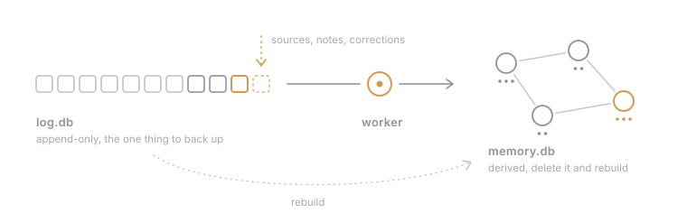

# pd-memory

Memory for agents that starts with a map. The agent gets a short overview of everything it knows at the start of a session, and opens the details when it needs them.

<p align="center"></p>

Most memory systems are built around search. That works when the agent knows what it is looking for, but in daily work it often doesn't even know there is something to search for. If I ask my agent what I should read this weekend, there is no good query. The answer depends on the shape of everything that is there, and that is what a search result doesn't show.

There are two failure modes to avoid. By trying to be complete, you are tempted to increase the token budget and bloat the context, and on the other end there is the search-only case, where the agent doesn't know what it can search for. pd-memory tries to sit between them with a dictionary-style overview. Subjects are pages, and below each page are one-line observations:

```text
## billing (project) — Usage-based billing for the platform. (14)
- 3f9a1c [3+] Customers are invoiced monthly from metered usage, and refunds need manual approval. (4; 12 Sep)
- 81d2e0 [2] The free tier was raised to 500 runs after the pricing review. (1; 28 Aug)
### invoicing (artifact) — Invoice generation and delivery. (5)
```

The id opens an entry, the number in brackets shows how prominent it is, a `+` means there is more detail behind it, and the end shows how many sources back it and when it happened. From there the agent can notice where it lacks detail, open the entry, follow links to related pages and check the sources behind a claim. Retrieval becomes part of the agent's thinking instead of a separate step.

## How it works

pd-memory reads conversations, meetings, coding sessions and documents, and a model turns them into observations. New material is compared with what is already there, so a repeated claim strengthens the existing observation and a later correction replaces the earlier one. Each observation keeps its sources, the evidence it came from, and its correction history.

A separate rating pass then judges how much each observation matters, calibrated against the rest of memory: how many kinds of requests it changes (reach), how likely an assistant would assume otherwise (surprise), whether it is a standing instruction (directive), how much care it needs (sensitivity), and how long it stays relevant (durability). The brief ranks by these ratings. Because rating is cheap and separate from extraction, a changed rating prompt re-rates the whole memory on the next run without a rebuild.

<p align="center"></p>

Everything that goes into memory is appended to a log first: sources, notes, corrections and forgets. A single worker reads the log in order and builds memory from it. The log is the only thing you need to back up, because memory can be deleted and rebuilt from it. A rebuild makes model calls again, so it costs money, but it loses nothing that was put in.

Closed periods are summarised once (days into weeks, weeks into months), and the current overview is refreshed after enough has changed. All of this happens when new material comes in, so there is no timer and no background service.

It is one Go executable and two SQLite files. Hosts call it as a CLI, and TypeScript hosts get a small typed client. Where it is still weak is when the big picture itself is the important information, because extracted observations tend to lose it.

This is an experimental personal project that I use daily with my own agents. The earlier TypeScript engine remains at tag `v0.1-typescript`.

## InMind benchmark

[InMind](https://github.com/imlrz/InMind) ([paper](https://arxiv.org/abs/2607.24368)) tests the case this design is built for. A user mentions a personal fact once, such as an allergy, and 38 sessions later asks something that never names it, such as a macaron recipe. Application counts answers that use the fact. I ran the benchmark on all 125 tasks with its answer model, judge, and prompts. The InMind team then re-judged the submitted answers; the pd-memory rows show their verified scores.

| System | Direct recall | Target recall | Application |
| --- | --- | --- | --- |
| pd-memory, brief and retrieval for the question | 93.6% | 84.8% | **70.4%** |
| pd-memory, brief and agent-driven search | 87.2% | 80.8% | **69.6%** |
| Naive RAG (text-embedding-3-large) | 97.6% | 6.4% | 16.0% |
| MemoryOS | 96.8% | 7.2% | 14.4% |
| A-Mem | 100.0% | 12.0% | 9.6% |
| HippoRAG 2 | 93.6% | 0.8% | 8.8% |
| Mem0 | 76.8% | 6.4% | 6.4% |
| Fact already in context (control) | | 100.0% | 84.0% |

Other rows are the paper's results from the [InMind leaderboard](https://keep-it-inmind.github.io/leaderboard/), each with its best reported embedding. pd-memory used `gpt-6-luna` to build memory, Perplexity `pplx-embed-v1-0.6b` embeddings, and `gpt-5-mini` to answer and judge; its context per question was about 1.3k to 2.1k tokens. These numbers do not measure the new OpenAI embedding default. One task failed during ingestion and counts as a miss. Each task builds its own small memory, so the brief never had to leave anything out; larger memories are the harder case and not measured here.

## Quickstart

```sh
curl -fsSL https://raw.githubusercontent.com/markschroedr/pd-memory/master/install.sh | sh
pd-memory init
```

The installer uses `~/.local/bin`; add it to `PATH` if your shell does not already include it. Alternatively, download a macOS, Linux, or Windows binary from [Releases](https://github.com/markschroedr/pd-memory/releases). Each platform has arm64 and x64 binaries. Go users can run `go install github.com/markschroedr/pd-memory@latest`.

`init` asks for your name and provider: OpenAI (recommended, default) or OpenRouter. Each choice needs exactly one key, hidden in a terminal. It creates a workspace and checks generation and embeddings live. It optionally adds Pi sessions as a source. Release binaries offer to install the matching Pi extension with `pi install`. Development builds use a local checkout instead.

Configuration lives in `~/.config/pd-memory/pd-memory.toml`. Use `PD_MEMORY_CONFIG` or `--config FILE` to select a different config. Credentials live in a separate private file; environment variables override them. Keep runtime data and credentials outside Git.

OpenAI uses `OPENAI_API_KEY` for `gpt-6-luna` generation (Flex, `store=false`) and `text-embedding-3-small` embeddings with 1024 dimensions. Init asks whether the account has zero data retention. Otherwise it explains that OpenAI may retain API data for abuse monitoring and requires explicit approval for standard retention before writing files. Declining writes nothing. `store=false` alone is not proof of ZDR.

OpenRouter uses `OPENROUTER_API_KEY` for `openai/gpt-6-luna` generation through the Azure ZDR route only, plus Perplexity embeddings. Both requests require ZDR and disable provider fallback. Init states this route restriction before requesting the key.

Config can mix generation and embedding providers, including a local Perplexity embedding service. Set the complete provider fields and corresponding pricing; do not change an existing workspace's embedding model without rebuilding its vectors. Embedding providers never fall back to one another. `doctor` checks the live models and exits non-zero when setup cannot run. Model calls cost money; `stats` shows recorded usage and estimated cost.

## Use

```sh
pd-memory ingest --path notes.txt --kind document --label Notes --wait
pd-memory brief
pd-memory recall --query "architecture decisions"
pd-memory open ID --history
pd-memory note --line "A durable observation." --page root --actor user --wait
pd-memory help
```

Add `--json` for machine output. `catalog` lists every command's input and result schema with the engine version. `brief --folder PATH` adds context for one project, and `focus` adjusts what that project's brief shows. Recall embeds queries with the configured embedding model. Read commands do not change observations.

Without `--wait`, ingestion returns once the entry is in the log and reports the queued work. `maintain` and `brief --compose` run maintenance by hand when a workspace has been quiet. `rebuild` keeps the old memory next to the new one.

Separate workspaces are the privacy boundary. There are no read filters.

## TypeScript hosts

Use `MemoryClient` from `integrations/client.ts`. Its `call(command, input)` returns the command's typed result. It checks the binary version on first use and reports conflicts separately from other failures.

Regenerate the committed types after command changes:

```sh
pd-memory catalog --typescript > integrations/types.ts
```

## Sources and sync

A **source** is a configured location with one adapter. A **unit** is one session, file, or query row. A **cursor** records the imported part; only its adapter interprets it. The engine imports nothing from a unit until the whole unit has been inactive for `settle_after` (default: 3 hours).

```sh
pd-memory sync --dry-run
pd-memory sync                 # queue settled increments; do not wait for extraction
pd-memory sync --source notes --wait
```

Sync is idempotent. Different units count as independent sources, even when their text is identical. Session adapters (`pi`, `claude-code`, `codex`) preserve imported message ids across branches and resumed sessions. Configure `after` before the first sync to avoid importing old history. Excludes are slash-separated globs relative to a source root; `**` matches any depth. Subagent and other unwanted folders are excluded through config, not hidden rules.

One folder example:

```toml
settle_after = "3h"
auto_sync = true

[[sources]]
name = "notes"
adapter = "files"
path = "~/notes"
kind = "document"
settle_after = "1h"
exclude = ["**/drafts/**"]
```

The `files` adapter reads `.txt` and `.md`. One file is one unit; modification time is activity. A cursor stores the imported prefix's byte length and hash. Appends import only new text. A rewritten prefix is reported and not re-imported.

One SQLite example:

```toml
[[sources]]
name = "meetings"
adapter = "sqlite"
path = "~/meetings.sqlite"
kind = "meeting"
query = "SELECT id AS unit_id, updated_at AS time, transcript AS text, title FROM meetings"
```

The read-only query must return unique `unit_id`, RFC3339 `time`, and `text` columns. `speaker` and `title` are optional. One row is one unit; `time` must track its last activity. Appended row text imports as a new increment; rewritten prefixes are reported. Excludes match unit ids. No product-specific database schema is built into the engine.

Routes use the longest matching folder root:

```toml
[[routes]]
root = "~/projects/example"
home = "example"
```

Unrouted folders use their last folder name, normalized to a page slug, as the home page. If that name cannot form a page slug, sync reports the unit under `unrouted`, leaves its cursor unchanged, and continues. Add an explicit route for that folder. Speaker names come from `identity.user_names`. When an imported unit resumes, extraction receives earlier source digests as read-only context. Only its new part can supply claims and citations.

## Pi

The [Pi package](integrations/pi.ts) exposes `memory_recall`, `memory_brief`, `memory_open`, `memory_note`, and `memory_focus`. Notes always have agent authority. The binary must be on Pi's `PATH`; the extension needs no separate settings file.

At session start the extension launches `pd-memory sync --auto` without waiting. Set `auto_sync = false` to disable this trigger; manual sync still works. Before each agent run it reads the current folder brief and adds the raw text as a named `memory_brief` system context block. It does not perform automatic recall or add hidden transcript messages. An unavailable engine warns and does not block the prompt.

For local development: `pi install /path/to/pd-memory`. Do not load this extension alongside another host's memory injection or duplicate memory tools.

## License

Copyright (c) 2026 Mark Schröder.

pd-memory is licensed under the [GNU Affero General Public License v3.0](LICENSE). If you run a modified version as a network service, you must offer its source to its users.

For use under other terms, for example in a closed-source product, a commercial license is available on request: mark@schroedermark.com.

Commits before this license change remain available under the MIT License.
